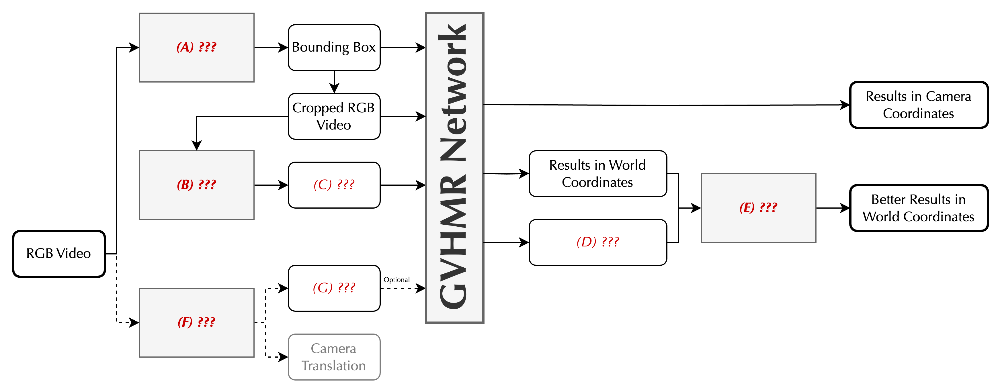

# Inspect GVHMR

## Background

GVHMR is a deep learning-based framework for monocular 4D Human Pose and Shape (HPS) estimation.
It reconstructs the global human motion and camera space human motion from a single RGB video.
Check the videos in the [GVHMR Project Page](https://zju3dv.github.io/gvhmr/) and the [GVHMR Paper](https://arxiv.org/pdf/2409.06662) to get a better understanding.

## Tasks

In this project, you are asked to run GVHMR on the H36M validation set, and quantitatively and qualitatively evaluate the results.

To achieve this, you should understand those components' implementations:

1. the GVHMR inference pipeline,
2. the GVHMR data processing and dataset wrapping,
3. the evaluation protocol.

Here, we provide brief guidance to help you to complete the task gradually.

The purpose of the project is to help you to learn a general research engineering process through a concrete example.

You may not follow the instructions strictly, but you should follow a reasonable trajectory to complete the task.

### Step 1: GVHMR Setup and Demo

The first step is to setup the [GVHMR codebase](https://github.com/zju3dv/GVHMR), you can find the instructions within the repository.

To validate whether the setup is successful, you can run the demo script to get some visualization results.

Play with the demo is always a good start point to understand most public codebases.

Before going to the next step, you can first try to answer these questions as a <b>self-check</b>:

1. Try to trace the data flow in the pipeline, filling in this:
   

2. What is SMPL?
    - If you are still not familiar with SMPL, play with <a href="https://github.com/IsshikiHugh/LearningHumans/blob/main/notebooks/SMPL_basic.ipynb" target="_blank">this notebook</a> to get a better understanding.

### Step 2: Data Preparation

For evaluating GVHMR on a new dataset, you need to 1) run GVHMR on the dataset, 2) compute the metrics over the results.
In this section, we focus on the first part.

To run a open-source pipeline on a new dataset, you can either use the demo script or the evaluation script (if exists).
Generally, demo script provides all the processes for running from solely in-the-wild inputs, but might be poorly batch-ready.
While the evaluation script typically run batch inference over a pre-processed dataset, and typically is coupled with some evaluation metrics computation.

For GVHMR, either is available.
Choose the best one you think is suitable for your task, and inspect the code to understand what's going on.

Then, you should have an overview of what kind of data is needed for the evaluation. 
Making a list of that might be helpful.

Then, you need to check the dataset structure and build the dataset processing pipeline.
Here you are required to process the validation set of H36M dataset.
The downloaded source is available at the cluster, ask the Professor for the details.

After solving both the code side issues and the dataset side issues, you should be able to run the pipeline over the dataset.

### (Optional) Step 2.5: Test Time Augmentation

There is a test time augmentation (TTA) used in GVHMR evaluation.
The details are mentioned in the paper.
Code is also available in the repository.
It's compatible with the current inference pipeline. 
You first go through the **Step 3** and then come back to this section if you want.

### Step 3: Evaluation and Visualization

After (or maybe during) running the pipeline over the dataset, you would have the predicted results.
They might be buggy (it's nice if there is no bug, but you need to verify it), and you want to debug.
In that case, having some quantitative or qualitative results helps.
For that, you should evaluate or visualize the results.
I suggest you to start with visualization, although metrics are often easier to compute.

Visualize the results in the same way as the demo script, check as much examples as you can, and try to find some interesting results.
You are encouraged to add some extra informative visualization to help you to inspect the results, that's one of the most important source where the insights come from.

After you think the visualization is there, and you confirm that you run the pipeline in a correct way, you can start to compute the metrics.

Here, please evaluate both camera-space metrics and world-space metrics.
Be careful with the metrics calculation, make sure you are aligned with the official protocol.

Finally, you should have a table like this:

| PA-MPJPE | MPJPE | PVE Accel  | WA-MPJPE | W-MPJPE  | RTE | Jitter  | Foot-Sliding |
|----------|-------|------------|----------|----------|-----|---------|--------------|
| ?        | ?     | ?          | ?        | ?        | ?   | ?       | ?            |

Tips: sometimes, checking the per-item results is helpful to dig deeper into the methods.

### Inspection Report

Please have these things prepared for the inspection:

1. A summary of the evaluation results.
2. Some visualization with captions.
3. Anything else you think can be interesting to share.

## References

- [GVHMR GitHub Repo](https://github.com/zju3dv/GVHMR)
- [GVHMR Project Page](https://zju3dv.github.io/gvhmr/)
- [GVHMR Paper](https://arxiv.org/pdf/2409.06662)
- [SMPL-related Notebooks](https://github.com/IsshikiHugh/LearningHumans)